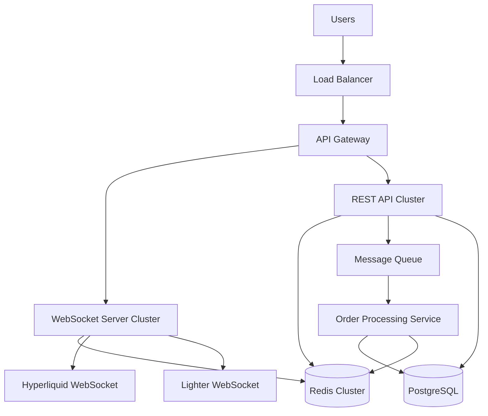

# Design Document

## Overview

The Perp DEX Aggregator is a real-time trading platform that aggregates perpetual futures data from Hyperliquid and Lighter DEX and provides a unified interface. The system follows a modular Python architecture with FastAPI for REST endpoints, WebSocket communication for real-time data, and Redis for caching.

## Architecture

### High-Level Architecture



### Technology Stack

- **Backend**: Python 3.11+ with asyncio for concurrent operations
- **API Framework**: FastAPI with automatic OpenAPI documentation
- **WebSocket**: FastAPI WebSocket support with Redis pub/sub for broadcasting
- **Database**: PostgreSQL with asyncpg for async database operations
- **Cache**: Redis for price caching, session management, and pub/sub
- **HTTP Client**: aiohttp for async external API calls
- **WebSocket Client**: websockets library for DEX connections
- **Monitoring**: Python logging with structured output
- **Containerization**: Docker with docker-compose for development

## Components and Interfaces

### 1. WebSocket Service

**Purpose**: Real-time data streaming and client communication

**Key Components**:
- `WebSocketManager`: Manages client connections and rooms
- `DEXConnector`: Handles connections to external DEX WebSockets
- `PriceAggregator`: Combines and processes price feeds
- `EventBroadcaster`: Distributes updates to connected clients

**Interfaces**:
```typescript
interface WebSocketManager {
  handleConnection(socket: Socket): void;
  joinRoom(socketId: string, room: string): void;
  broadcastToRoom(room: string, event: string, data: any): void;
}

interface DEXConnector {
  connect(dexConfig: DEXConfig): Promise<void>;
  subscribe(pairs: string[]): void;
  onPriceUpdate(callback: (data: PriceUpdate) => void): void;
  reconnect(): Promise<void>;
}
```

### 2. REST API Service

**Purpose**: HTTP endpoints for trading, user management, and data queries

**Key Components**:
- `AuthController`: Wallet authentication and JWT management
- `TradingController`: Order placement and execution
- `PositionController`: Position management and queries
- `AnalyticsController`: Trading history and performance metrics

**Interfaces**:
```typescript
interface TradingController {
  calculateRoute(orderRequest: OrderRequest): Promise<RouteResult>;
  executeOrder(order: Order, userId: string): Promise<ExecutionResult>;
  getOrderStatus(orderId: string): Promise<OrderStatus>;
}

interface PositionController {
  getUserPositions(userId: string): Promise<Position[]>;
  getPositionHistory(userId: string, filters: PositionFilters): Promise<Position[]>;
  calculateLiquidationPrice(position: Position): number;
}
```

### 3. Order Processing Service

**Purpose**: Asynchronous order execution and transaction management

**Key Components**:
- `OrderRouter`: Determines optimal execution path
- `TransactionBuilder`: Constructs blockchain transactions
- `ExecutionEngine`: Handles order execution across DEXs
- `FailureHandler`: Manages retry logic and error recovery

### 4. Authentication Service

**Purpose**: Wallet-based authentication and session management

**Key Components**:
- `WalletAuthenticator`: SIWE implementation
- `JWTManager`: Token generation and validation
- `SessionStore`: Redis-based session management

## Data Models

### Core Entities

```typescript
// User and Authentication
interface User {
  id: string;
  walletAddress: string;
  connectedWallets: string[];
  preferences: UserPreferences;
  createdAt: Date;
  lastLoginAt: Date;
}

interface AuthSession {
  userId: string;
  walletAddress: string;
  token: string;
  expiresAt: Date;
  nonce: string;
}

// Trading and Orders
interface Order {
  id: string;
  userId: string;
  pair: string;
  side: 'long' | 'short';
  size: number;
  price?: number; // undefined for market orders
  orderType: 'market' | 'limit';
  status: OrderStatus;
  routedTo: string; // DEX identifier
  createdAt: Date;
  executedAt?: Date;
}

interface Position {
  id: string;
  userId: string;
  dex: string;
  pair: string;
  side: 'long' | 'short';
  size: number;
  entryPrice: number;
  currentPrice: number;
  unrealizedPnl: number;
  liquidationPrice: number;
  fundingRate: number;
  margin: number;
  createdAt: Date;
  updatedAt: Date;
}

// Market Data
interface PriceData {
  pair: string;
  dex: string;
  bid: number;
  ask: number;
  lastPrice: number;
  volume24h: number;
  fundingRate: number;
  timestamp: Date;
}

interface AggregatedPrice {
  pair: string;
  bestBid: number;
  bestAsk: number;
  bestBidDex: string;
  bestAskDex: string;
  sources: PriceSource[];
  timestamp: Date;
}
```

### Database Schema

**PostgreSQL Tables**:
- `users` - User profiles and preferences
- `auth_sessions` - Active authentication sessions
- `orders` - Order history and status
- `positions` - Current and historical positions
- `trades` - Executed trade records
- `price_history` - Time-series price data (TimescaleDB)

**Redis Data Structures**:
- `prices:{pair}` - Current aggregated prices (TTL: 100ms)
- `sessions:{userId}` - User session data (TTL: 24h)
- `routes:{hash}` - Cached routing calculations (TTL: 10s)
- `connections:{userId}` - WebSocket connection mapping

## Error Handling

### Error Categories

1. **Network Errors**: DEX connection failures, RPC timeouts
2. **Authentication Errors**: Invalid signatures, expired tokens
3. **Trading Errors**: Insufficient liquidity, slippage exceeded
4. **System Errors**: Database failures, service unavailability

### Error Handling Strategy

```typescript
interface ErrorHandler {
  handleDEXConnectionError(dex: string, error: Error): void;
  handleOrderExecutionError(order: Order, error: Error): Promise<void>;
  handleSystemError(error: Error, context: string): void;
}

// Retry Logic
interface RetryConfig {
  maxAttempts: number;
  backoffMultiplier: number;
  maxBackoffMs: number;
}
```

### Circuit Breaker Pattern

Implement circuit breakers for external DEX connections:
- **Closed**: Normal operation
- **Open**: Stop requests after failure threshold
- **Half-Open**: Test recovery with limited requests

## Testing Strategy

### Unit Testing
- **Controllers**: Mock dependencies, test business logic
- **Services**: Test individual service methods with mocked external calls
- **Utilities**: Test helper functions and calculations
- **Models**: Test data validation and transformations

### Integration Testing
- **API Endpoints**: Test complete request/response cycles
- **Database Operations**: Test with test database instance
- **WebSocket Events**: Test real-time communication flows
- **External Integrations**: Test with DEX testnets where available

### End-to-End Testing
- **User Flows**: Complete trading workflows from authentication to execution
- **Error Scenarios**: Network failures, invalid inputs, edge cases
- **Performance**: Load testing with concurrent users and high-frequency updates

### Testing Infrastructure
- **Test Database**: Separate PostgreSQL instance with test data
- **Mock Services**: Mock external DEX APIs and blockchain RPCs
- **Test Fixtures**: Predefined test data for consistent testing
- **CI/CD Pipeline**: Automated testing on code changes

## Security Considerations

### Authentication Security
- SIWE implementation with proper nonce validation
- JWT tokens with short expiration and refresh mechanism
- Rate limiting per wallet address and IP

### API Security
- Input validation and sanitization for all endpoints
- CORS configuration for allowed origins
- Request size limits and timeout configurations

### Infrastructure Security
- Environment variable management for sensitive data
- Database connection encryption
- Redis AUTH for cache access
- Network segmentation between services

## Performance Optimizations

### Caching Strategy
- **L1 Cache**: In-memory price aggregation (100ms TTL)
- **L2 Cache**: Redis for routing calculations (10s TTL)
- **L3 Cache**: Database query results for analytics (5min TTL)

### Database Optimization
- Indexed queries for user positions and trade history
- Partitioned tables for time-series price data
- Read replicas for analytics queries
- Connection pooling for concurrent access

### WebSocket Optimization
- Connection pooling to external DEXs
- Message batching for price updates
- Room-based broadcasting to reduce bandwidth
- Sticky sessions for horizontal scaling