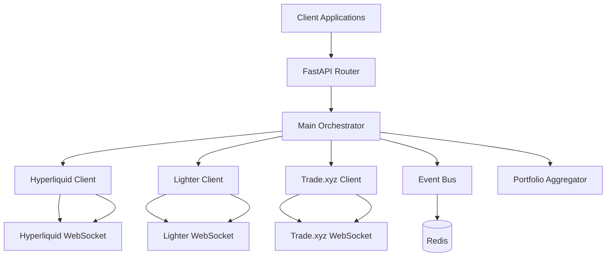

# Design Document

## Overview

The Unified Trading Terminal is built as a FastAPI-based microservice architecture that provides a single interface for trading across multiple DEXs (Hyperliquid, Lighter, trade.xyz). The system uses an orchestrator pattern to route requests to venue-specific clients, with real-time data synchronization via WebSockets and Redis-based event bus for cross-component communication.

## Architecture

### High-Level Architecture



### Component Architecture

The system follows a layered architecture with clear separation of concerns:

1. **API Layer**: FastAPI endpoints for external communication
2. **Orchestration Layer**: Request routing and coordination
3. **Client Layer**: Venue-specific implementations
4. **Core Layer**: Shared utilities and configuration
5. **Data Layer**: Models and persistence

## Components and Interfaces

### Core Components

#### Main Orchestrator (`orchestrator/main_orchestrator.py`)
- **Purpose**: Central coordinator that routes requests to appropriate venue clients
- **Key Methods**:
  - `route_order(venue: VenueEnum, order: UnifiedOrder) -> OrderResponse`
  - `get_positions(venue: VenueEnum) -> List[Position]`
  - `cancel_order(venue: VenueEnum, order_id: str) -> CancelResponse`
- **Dependencies**: All venue clients, event bus, portfolio aggregator

#### Event Bus (`orchestrator/event_bus.py`)
- **Purpose**: Pub/sub system for cross-venue event coordination
- **Key Methods**:
  - `publish(event: Event) -> None`
  - `subscribe(event_type: str, callback: Callable) -> None`
  - `unsubscribe(event_type: str, callback: Callable) -> None`
- **Implementation**: Redis-based pub/sub with JSON serialization

#### Portfolio Aggregator (`orchestrator/portfolio_aggregator.py`)
- **Purpose**: Aggregates and normalizes data from all venue clients
- **Key Methods**:
  - `aggregate_positions() -> List[Position]`
  - `aggregate_balances() -> List[Balance]`
  - `calculate_total_pnl() -> Decimal`
- **Data Sources**: All venue clients via event bus

### Venue Client Architecture

#### Base Client (`clients/base_client.py`)
- **Purpose**: Abstract base class defining common interface for all venue clients
- **Key Abstract Methods**:
  - `place_order(order: UnifiedOrder) -> OrderResponse`
  - `cancel_order(order_id: str) -> CancelResponse`
  - `get_positions() -> List[Position]`
  - `get_balances() -> List[Balance]`
  - `subscribe_market_data(symbols: List[str]) -> None`

#### Venue-Specific Clients
Each venue (Hyperliquid, Lighter, Trade.xyz) implements:

**Client (`client.py`)**
- Main client implementation inheriting from BaseClient
- Handles HTTP API calls and response processing
- Manages connection pooling and rate limiting

**WebSocket Handler (`websocket.py`)**
- Real-time data streaming
- Order status updates
- Market data feeds
- Connection management and reconnection logic

**Authentication (`auth.py`)**
- Venue-specific authentication mechanisms
- API key management
- Signature generation for requests

**Order Manager (`order_manager.py`)**
- Order lifecycle tracking
- Local order state management
- Order status synchronization

**Position Tracker (`position_tracker.py`)**
- Real-time position updates
- PnL calculations
- Position reconciliation

**Normalizer (`normalizer.py`)**
- Converts venue-specific data formats to unified models
- Handles field mapping and data type conversions

## Data Models

### Unified Models (`models/unified.py`)

```python
@dataclass
class UnifiedOrder:
    symbol: str
    side: OrderSide
    order_type: OrderType
    quantity: Decimal
    price: Optional[Decimal]
    venue: VenueEnum
    client_order_id: str
    timestamp: datetime

@dataclass
class Position:
    venue: VenueEnum
    symbol: str
    size: Decimal
    entry_price: Decimal
    mark_price: Decimal
    unrealized_pnl: Decimal
    realized_pnl: Decimal
    timestamp: datetime

@dataclass
class Balance:
    venue: VenueEnum
    asset: str
    total: Decimal
    available: Decimal
    locked: Decimal
    timestamp: datetime
```

### Enums (`models/enums.py`)

```python
class VenueEnum(str, Enum):
    HYPERLIQUID = "hyperliquid"
    LIGHTER = "lighter"
    TRADEXYZ = "tradexyz"

class OrderType(str, Enum):
    MARKET = "market"
    LIMIT = "limit"
    STOP_MARKET = "stop_market"
    STOP_LIMIT = "stop_limit"

class OrderSide(str, Enum):
    BUY = "buy"
    SELL = "sell"

class OrderStatus(str, Enum):
    PENDING = "pending"
    OPEN = "open"
    FILLED = "filled"
    CANCELLED = "cancelled"
    REJECTED = "rejected"
```

### Event Models (`core/events.py`)

```python
@dataclass
class OrderEvent:
    event_type: str
    venue: VenueEnum
    order_id: str
    status: OrderStatus
    data: Dict[str, Any]
    timestamp: datetime

@dataclass
class PositionEvent:
    event_type: str
    venue: VenueEnum
    symbol: str
    position_data: Position
    timestamp: datetime
```

## Error Handling

### Exception Hierarchy (`core/exceptions.py`)

```python
class TradingTerminalException(Exception):
    """Base exception for all trading terminal errors"""

class VenueConnectionError(TradingTerminalException):
    """Raised when venue connection fails"""

class AuthenticationError(TradingTerminalException):
    """Raised when authentication fails"""

class OrderValidationError(TradingTerminalException):
    """Raised when order validation fails"""

class InsufficientBalanceError(TradingTerminalException):
    """Raised when insufficient balance for order"""
```

### Error Handling Strategy

1. **Circuit Breaker Pattern**: Prevent cascading failures when venues are down
2. **Retry Logic**: Exponential backoff for transient failures
3. **Graceful Degradation**: Continue operating with available venues
4. **Error Logging**: Structured logging for debugging and monitoring
5. **User-Friendly Messages**: Convert technical errors to actionable user messages

## Testing Strategy

### Unit Testing
- **Venue Clients**: Mock external API calls, test data normalization
- **Orchestrator**: Test routing logic and error handling
- **Event Bus**: Test pub/sub functionality with Redis mock
- **Models**: Test data validation and serialization

### Integration Testing
- **End-to-End Flows**: Test complete order lifecycle across venues
- **WebSocket Integration**: Test real-time data streaming
- **Database Integration**: Test data persistence and retrieval
- **Redis Integration**: Test event bus functionality

### Performance Testing
- **Load Testing**: Simulate high-frequency trading scenarios
- **Latency Testing**: Measure order execution times
- **Stress Testing**: Test system behavior under resource constraints
- **WebSocket Performance**: Test concurrent connection handling

### Security Testing
- **Authentication Testing**: Verify secure credential handling
- **Input Validation**: Test against malicious inputs
- **Rate Limiting**: Verify rate limiting effectiveness
- **Data Encryption**: Test sensitive data protection

## Configuration Management

### Environment Variables (`.env`)
- Database and Redis connection strings
- Venue API endpoints and WebSocket URLs
- Authentication credentials (encrypted)
- Cache TTL settings
- CORS configuration
- WebSocket configuration parameters

### Configuration Loading (`core/config.py`)
- Pydantic-based configuration management
- Environment-specific settings
- Validation of required configuration
- Default value handling

## Deployment Considerations

### Docker Configuration
- Multi-stage builds for optimized images
- Health checks for container orchestration
- Environment-specific configurations
- Volume mounts for persistent data

### Monitoring and Observability
- Structured logging with correlation IDs
- Metrics collection for order latency and success rates
- Health check endpoints for each venue
- WebSocket connection monitoring
- Redis connection health checks

### Scalability
- Horizontal scaling via load balancers
- Redis clustering for high availability
- Database connection pooling
- Async/await patterns for I/O operations
- WebSocket connection pooling